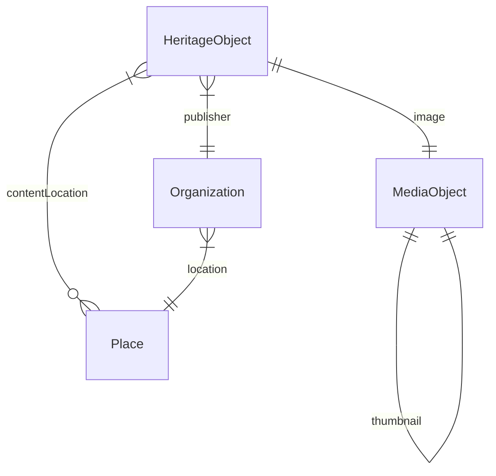

# GVN Search and Find: data model

## Contents

1. [Conceptual Data Model (CDM)](#conceptual-data-model-cdm)
1. [RDF Data Model (RDM)](#rdf-data-model-rdm)

## Conceptual Data Model (CDM)

The data that are required to make the app work.

### Entities and properties

#### Heritage object

|Name|Datatype|Cardinality|Description|Remarks|Example|
|-|-|-|-|-|-|
|ID|ID|1|Identifier of the object|-|`http://data.collectienederland.nl/resource/document/zuiderzeemuseum/FR06089`|
|Type|String|1|Type of the object|-|`CreativeWork`|
|Specific type|String|0 or more|Specific type of the object|-|`foto`, `tekening`|
|Title|String|1|Primary title of the object|-|`Enkhuizen. Zuidertoren met buurt.`|
|Description|String|0 or 1|Short description of the object|-|`Prentbriefkaart uit de Collectie Ringeling`|
|Date created|Date|0 or 1|Date when the object was created (precise or a range)|Normalized date (not provided by all sources)|`1900`|
|Location|ID|0 or more|Location depicted on or described by the object|-|`Enkhuizen`|
|URL of webpage|URL|1|Online location where the object is presented|-|`http://hdl.handle.net/21.12111/zzm-collect-72250`|
|Image|ID|1|Image of the object|TBD: what if there is no image, just e.g. an audio fragment?|`https://images.memorix.nl/zzm/download/fullsize/7ab75b4f-3e37-9f95-bbc2-ae5d8f4eed6d/image`|
|Creator|String|0 or more|Creator of the object|Datatype = string, not ID (won't be used for structured searching)|(todo)|
|Publisher|ID|1|Publisher of the object|-|`https://www.zuiderzeemuseum.nl/`|
|Source|ID|1|Source of the data, for traceability|-|(todo)|

### Place

|Name|Datatype|Cardinality|Description|Remarks|Example|
|-|-|-|-|-|-|
|ID|ID|1|Identifier of the place|-|`https://sws.geonames.org/2756077/`|
|Type|String|1|Type of the place|-|`Place`|
|Name|String|1|Primary name of the place|-|`Enkhuizen`|

### Media object

|Name|Datatype|Cardinality|Description|Remarks|Example|
|-|-|-|-|-|-|
|ID|ID|1|Identifier of the object|-|`https://images.memorix.nl/zzm/download/fullsize/7ab75b4f-3e37-9f95-bbc2-ae5d8f4eed6d/image`|
|Type|String|1|Type of the object|-|`Image`, `Video`, `Audio`|
|URL|URL|1|Online location where the object can be found|-|`https://images.memorix.nl/zzm/download/fullsize/7ab75b4f-3e37-9f95-bbc2-ae5d8f4eed6d`|
|MIME type of the object|String|0 or 1|MIME type of the object|-|`image/tif`|
|License|String|1|License for using the object|-|`BY-SA`|
|Thumbnail|ID|0 or 1|Identifier of a thumbnail of the object|-|`https://images.memorix.nl/zzm/download/fullsize/7ab75b4f-3e37-9f95-bbc2-ae5d8f4eed6d/thumbnail`|

### Organization

|Name|Datatype|Cardinality|Description|Remarks|Example|
|-|-|-|-|-|-|
|ID|ID|1|Identifier of the organization|-|`https://www.zuiderzeemuseum.nl/`|
|Type|String|1|Type of the organization|-|`Organization`|
|Name|String|1|Primary name of the organization|-|`Zuiderzeemuseum`|
|URL of homepage|URL|0 or 1|Homepage of the organization, for finding more information|-|`https://www.zuiderzeemuseum.nl/`|
|Location|String|0 or 1|Primary location of the organization|-|`Enkhuizen`|

### Diagram



## RDF Data Model (RDM)

Translation of the Conceptual Data Model to RDF.

The aim is to make it easy for frontend developers to use the data. This means: use a single, straightforward vocabulary and transform the data of the sources, where applicable, to make it fit the vocabulary.

### Entities and properties

#### Heritage object

|Name in CDM|Name|Datatype|Description|Remarks|Example|
|-|-|-|-|-|-|
|ID|Not applicable|IRI|Identifier of the object|-|`http://data.collectienederland.nl/resource/document/zuiderzeemuseum/FR06089`|
|Type|`rdf:type`|IRI|Type of the object|TBD: allow other types?|`schema:CreativeWork`|
|Specific type|`schema:additionalType`|IRI|Specific type of the object|Terminology source: CHT.|`https://data.cultureelerfgoed.nl/term/id/cht/1ea51d41-ca5c-40d3-8a85-362968878b0d`|
|Title|`schema:name`|Literal|Primary title of the object|-|`Enkhuizen. Zuidertoren met buurt.`|
|Description|`schema:description`|Literal|Short description of the object|-|`Prentbriefkaart uit de Collectie Ringeling`|
|Date created|`schema:dateCreated`|Date|Date when the object was created (precise or a range)|-|`1900`|
|Location|`schema:contentLocation`|IRI|Location depicted on or described by the object|Terminology source: GeoNames. TBD: in Schema.org this should be of type `schema:Place`|`https://sws.geonames.org/2756077/`|
|URL of webpage|`schema:mainEntityOfPage`|IRI|Online location where the object is presented|-|`http://hdl.handle.net/21.12111/zzm-collect-72250`|
|Image|`schema:image`|IRI|Image of the object|-|`https://images.memorix.nl/zzm/download/fullsize/7ab75b4f-3e37-9f95-bbc2-ae5d8f4eed6d/image`|
|Creator|`schema:creator`|Literal|Creator of the object|Literal, not a term (no need for currently)|-|
|Publisher|`schema:publisher`|IRI|Publisher of the object|-|`https://www.zuiderzeemuseum.nl/`|
|Source|`schema:isBasedOn`|IRI|Source of the data, for traceability|-|`http://data.collectienederland.nl/resource/document/zuiderzeemuseum/FR06089`|

#### Media object

|Name in CDM|Name|Datatype|Remarks|Example|
|-|-|-|-|-|
|ID|Not applicable|IRI|Probably a blank node|`https://images.memorix.nl/zzm/download/fullsize/7ab75b4f-3e37-9f95-bbc2-ae5d8f4eed6d/image`|
|Type|`rdf:type`|IRI|TBD: which types are allowed?|`schema:ImageObject`|
|URL|`schema:contentUrl`|IRI|-|`https://images.memorix.nl/zzm/download/fullsize/7ab75b4f-3e37-9f95-bbc2-ae5d8f4eed6d`|
|MIME type|`schema:encodingFormat`|Literal|This value probably doesn't come from the source; it's added by NDE's data processor|`image/tif`|
|License|`schema:license`|IRI|TBD: should we also expose the name of the license, e.g. "BY-SA"?|`http://creativecommons.org/licenses/by-sa/4.0/deed.nl`|
|Thumbnail|`schema:thumbnail`|IRI|Probably a blank node|`https://images.memorix.nl/zzm/download/fullsize/7ab75b4f-3e37-9f95-bbc2-ae5d8f4eed6d/thumbnail`|

#### Organization

|Name in CDM|Name|Datatype|Remarks|Example|
|-|-|-|-|-|
|ID|Not applicable|IRI|TBD: can we get this info from the source? Or do we need to add it?|`https://www.zuiderzeemuseum.nl`|
|Type|`rdf:type`|IRI|Value allowed: `schema:Organization`|`schema:Organization`|
|Name|`schema:name`|Literal|-|`Zuiderzeemuseum`|
|URL of homepage|`schema:mainEntityOfPage`|IRI|This value doesn't come from the source; it's added by NDE's data processor|`https://www.zuiderzeemuseum.nl`|
|Location|`schema:location`|IRI|This value doesn't come from the source; it's added by NDE's data processor. Terminology source: GeoNames. TBD: in Schema.org this should be of type `schema:Place`.|`https://sws.geonames.org/2756077/`|

### Example

#### Heritage object

```turtle
<http://hdl.handle.net/21.12111/zzm-collect-72250>
  a schema:CreativeWork ;
  schema:additionalType <https://data.cultureelerfgoed.nl/term/id/cht/1ea51d41-ca5c-40d3-8a85-362968878b0d> ;
  schema:name "Enkhuizen. Zuidertoren met buurt." ;
  schema:description "Prentbriefkaart uit de Collectie Ringeling" ;
  schema:dateCreated "1900" ;
  schema:contentLocation <https://sws.geonames.org/2756077/> ;
  schema:mainEntityOfPage <http://hdl.handle.net/21.12111/zzm-collect-72250> ;
  schema:image <https://images.memorix.nl/zzm/download/fullsize/7ab75b4f-3e37-9f95-bbc2-ae5d8f4eed6d/image> ;
  schema:publisher <https://www.zuiderzeemuseum.nl> ;
  schema:isBasedOn <http://data.collectienederland.nl/resource/document/zuiderzeemuseum/FR06089> .
```

#### Place

```turtle
<https://sws.geonames.org/2756077/>
  a schema:Place ;
  schema:name "Enkhuizen" .
```

#### Media objects

```turtle
<https://images.memorix.nl/zzm/download/fullsize/7ab75b4f-3e37-9f95-bbc2-ae5d8f4eed6d/image>
  a schema:ImageObject ;
  schema:contentUrl <https://images.memorix.nl/zzm/download/fullsize/7ab75b4f-3e37-9f95-bbc2-ae5d8f4eed6d> ;
  schema:encodingFormat "image/tif" ;
  schema:license <http://creativecommons.org/licenses/by-sa/4.0/deed.nl> ;
  schema:thumbnail <https://images.memorix.nl/zzm/download/fullsize/7ab75b4f-3e37-9f95-bbc2-ae5d8f4eed6d/thumbnail> .
```

```turtle
<https://images.memorix.nl/zzm/download/fullsize/7ab75b4f-3e37-9f95-bbc2-ae5d8f4eed6d/thumbnail>
  a schema:ImageObject ;
  schema:contentUrl <https://images.memorix.nl/zzm/thumb/1600x1600/7ab75b4f-3e37-9f95-bbc2-ae5d8f4eed6d.jpg> ;
  schema:encodingFormat "image/jpeg" ;
  schema:license <http://creativecommons.org/licenses/by-sa/4.0/deed.nl> .
```

#### Organization

```turtle
<https://www.zuiderzeemuseum.nl>
  a schema:Organization ;
  schema:name "Zuiderzeemuseum"@nl ;
  schema:mainEntityOfPage <https://www.zuiderzeemuseum.nl> ;
  schema:location <https://sws.geonames.org/2756077/> .
```
