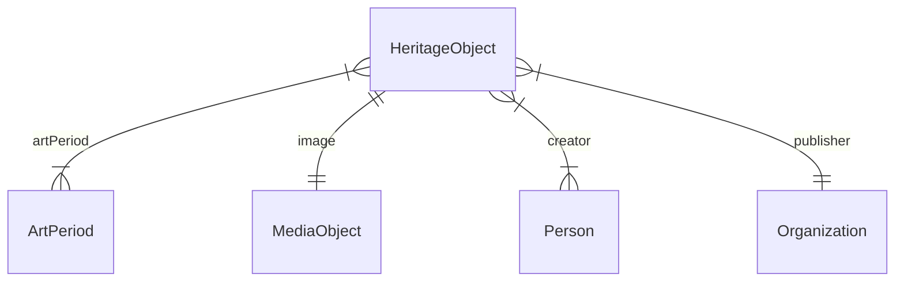

# Heritageflix: data model

## Contents

1. [Conceptual Data Model (CDM)](#conceptual-data-model-cdm)
1. [RDF Data Model (RDM)](#rdf-data-model-rdm)

## Conceptual Data Model (CDM)

The data that are required to make the app work.

### Entities and properties

#### Heritage object

|Name|Datatype|Cardinality|Description|Example|
|-|-|-|-|-|
|ID|ID|1|Identifier of the object|`http://hdl.handle.net/10934/RM0001.COLLECT.10001`|
|Type|String|1|Type of the object|`Artwork`|
|Specific type|String|TBD: 1 or more?|Specific type of the object|`Easel painting`|
|Title|String|1|Primary title of the object|`Allegorie op de bloei van de Nederlandse visserij na de Tweede Engelse Zeeoorlog`|
|Description|String|1|Short description of the object|`Allegorie op de bloei van de Nederlandse visserij na de Tweede Engelse Zeeoorlog (1665-67). Groepsportret van Nederlandse admiraals staande aan de oever van de zee.`|
|Date created|String|1|Date when the object was created (precise or a range)|`1667`, `1600-1700`, `1667 - 1671`, `circa 1650`|
|Year created|Number|1|Year (if known or retrievable from a range or string) when the object was created, to allow for sorting|`1667`, `1600`, `1650`|
|URL of webpage|URL|0 or 1|Online location where the object is presented|`http://hdl.handle.net/10934/RM0001.COLLECT.10001`|
|Art period and style|ID|1 or more|Art period and style of the object, according to the AAT|`http://vocab.getty.edu/aat/300021147`|
|Image|ID|1|Image of the object|`http://hdl.handle.net/10934/RM0001.COLLECT.10001/image`|
|Creator|ID|1 or more|Creator of the object|`https://data.rkd.nl/artists/26887`|
|Publisher|ID|1|Publisher of the object|`https://www.rijksmuseum.nl`|
|Source|ID|1|Source of the data, for traceability|`http://hdl.handle.net/10934/RM0001.COLLECT.10001`|

### Art period and style

|Name|Datatype|Cardinality|Description|Example|
|-|-|-|-|-|
|ID|ID|1|Identifier of the term|`http://vocab.getty.edu/aat/300021147`|
|Type|String|1|Type of the term|`Art period`|
|Name|String|1|Name of the term|`Baroque`|
|Start year|Number|1|Year that marks the start of the period, to allow for sorting|`1590`|
|End year|Number|0 or 1: not set if the period is ongoing|Year that marks the end of the period, to allow for sorting|`1750`|

The art periods supported by the app:

1. Medieval: if year of creation >= 1000 and < 1450. AAT term: `http://vocab.getty.edu/aat/300020756`
1. Renaissance: if year of creation >= 1450 and < 1600. AAT term: `http://vocab.getty.edu/aat/300021140`
1. Baroque: if year of creation >= 1600 and < 1750. AAT term: `http://vocab.getty.edu/aat/300021147`
1. Classicism: if year of creation >= 1750 and < 1850. AAT term: `http://vocab.getty.edu/aat/300056513`
1. Realist: if year of creation >= 1830 and < 1870. AAT term: `http://vocab.getty.edu/aat/300172861`
1. Impressionist: if year of creation >= 1860 and < 1890. AAT term: `http://vocab.getty.edu/aat/300021503`
1. Modernist: if year of creation >= 1890 and < 1970. AAT term: `http://vocab.getty.edu/aat/300021474`
1. Postmodern: if year of creation >= 1970. AAT term: `http://vocab.getty.edu/aat/300022208`

Notes:
1. If an artwork was created in a year that belongs to two or more art periods (i.e. Romantic and Realist), the corresponding AAT terms should be assigned.
1. The supported art periods aren't perfect. For example, what if an artwork was created in 2022 but its style is Romantic? Currently art period Postmodern is assigned. This suffices for the prototype, but should be resolved in a real-world app.
1. The years of the art periods can be subject to debate. Heritage institutions and art historians can use other periods than the app. Ideally we could re-use the art periods used by the institutions, but this data is currently not present in their source data.

### Media object

|Name|Datatype|Cardinality|Description|Example|
|-|-|-|-|-|
|ID|ID|1|Identifier of the object|`http://hdl.handle.net/10934/RM0001.COLLECT.10001/image`|
|Type|String|1|Type of the object|`Image`|
|URL|URL|1|Online location where the object can be found|`https://lh3.googleusercontent.com/Ks-HM3WNwUrnkukVya9poQn_JMHy7hXx226X70MmtC7g9wLs3Ki_yZtEQ0Zkp6PPNARx1SZKStnaPNjnuE-hWMDzcg=s0`|
|MIME type|String|TBD: 1?|MIME type of the object|`image/jpeg`|
|License|String|1|License for using the object|`Public domain`|

### Person

|Name|Datatype|Cardinality|Description|Example|
|-|-|-|-|-|
|ID|ID|1|Identifier of the person|`https://data.rkd.nl/artists/26887`|
|Type|String|1|Type of the person|`Person`|
|Name|String|1|Name of the person|`Eversdijck, Willem`|

### Organization

|Name|Datatype|Cardinality|Description|Example|
|-|-|-|-|-|
|ID|ID|1|Identifier of the organization|`https://www.rijksmuseum.nl`|
|Type|String|1|Type of the organization|`Organization`|
|Name|String|1|Name of the organization|`Rijksmuseum`|
|URL of homepage|URL|TBD: 0 or 1?|Homepage of the organization, for finding more information|`https://www.rijksmuseum.nl`|

### Diagram



## RDF Data Model (RDM)

Translation of the Conceptual Data Model to RDF.

The aim is to make it easy for frontend developers to use the data. This means: use a single, straightforward vocabulary and transform the data of the sources, where applicable, to make it fit the vocabulary.

### Entities and properties

#### Heritage object

|Name in CDM|Name|Datatype|Remarks|Example|
|-|-|-|-|-|
|ID|Not applicable|IRI|-|`http://hdl.handle.net/10934/RM0001.COLLECT.10001`|
|Type|`rdf:type`|IRI|TBD: use `schema:VisualArtwork` (specific) or `schema:CreativeWork` (generic)?|
|Specific type|`schema:artform` (specific) or `schema:additionalType` (generic)|IRI|TBD: which predicate?|`http://vocab.getty.edu/aat/300177435`|
|Title|`schema:name`|Literal|TBD: do we need the Dutch or also the English label?|`Allegorie op de bloei van de Nederlandse visserij na de Tweede Engelse Zeeoorlog`@nl|
|Description|`schema:description`|Literal|TBD: do we need the Dutch or also the English label?|`Allegorie op de bloei van de Nederlandse visserij na de Tweede Engelse Zeeoorlog (1665-67). Groepsportret van Nederlandse admiraals staande aan de oever van de zee.`@nl|
|Date created|`schema:temporal`|Literal|TBD: is there a better predicate? Dates aren't always ISO 8601 formatted, so we can't use `schema:dateCreated`|`1667`, `1600-1700`, `1667 - 1671`, `circa 1650`|
|Year created|`schema:dateCreated`|`schema:Date`|The year doesn't always come from the source - it could have been extracted by NDE's data processor|`1667`, `1600`, `1650`|
|URL of webpage|`schema:mainEntityOfPage`|IRI|`http://hdl.handle.net/10934/RM0001.COLLECT.10001`|
|Art period and style|`schema:temporalCoverage`|IRI|TBD: is there a better predicate? Also, this data doesn't come from the source; it's added by NDE's data processor|`http://vocab.getty.edu/aat/300021147`|
|Image|`schema:image`|IRI|TBD: probably a blank node?|-|
|Creator|`schema:creator`|IRI|TBD: can we align the creators of all data sources with RKDartists?|`https://data.rkd.nl/artists/26887`|
|Publisher|`schema:publisher`|IRI|-|`https://www.rijksmuseum.nl`|
|Source|`schema:isBasedOn`|IRI|-|`http://hdl.handle.net/10934/RM0001.COLLECT.10001`

#### Art period and style

|Name in CDM|Name|Datatype|Remarks|Example|
|-|-|-|-|-|
|ID|Not applicable|IRI|`http://vocab.getty.edu/aat/300021147`|
|Type|`rdf:type`|IRI|TBD: `schema:DefinedTerm` as value? Or `skos:Concept`, as provided by the source/AAT?|-|
|Name|`schema:name`|Literal|TBD: do we need the Dutch or also the English label?|`Barok`|
|Start year|`schema:startDate`|`schema:Date`|TBD: is there a better predicate? Also, this value doesn't come from the source; it's added by NDE's data processor|`1590`|
|End year|`schema:endDate`|`schema:Date`|TBD: is there a better predicate? Also, this value doesn't come from the source; it's added by NDE's data processor|`1750`|

**TBD**: is it useful to have a `schema:inDefinedTermSet` predicate, to denote that the art periods belong to a specific term set? This would allow us to add other resources of type `schema:DefinedTerm`, too, even if they're not art periods, but distinguish these from art periods.

#### Media object

|Name in CDM|Name|Datatype|Remarks|Example|
|-|-|-|-|-|
|ID|Not applicable|IRI|TBD: probably a blank node|-|
|Type|`rdf:type`|IRI|Value allowed: `schema:ImageObject`|`schema:ImageObject`|
|URL|`schema:contentUrl`|IRI|-|`https://lh3.googleusercontent.com/Ks-HM3WNwUrnkukVya9poQn_JMHy7hXx226X70MmtC7g9wLs3Ki_yZtEQ0Zkp6PPNARx1SZKStnaPNjnuE-hWMDzcg=s0`|
|MIME type|`schema:encodingFormat`|Literal|This value probably doesn't come from the source; it's added by NDE's data processor|`image/jpeg`|
|License|`schema:license`|IRI|TBD: should we also expose the name of the license, e.g. "Public Domain"?|`http://creativecommons.org/publicdomain/zero/1.0/deed.nl`|

#### Person

|Name in CDM|Name|Datatype|Remarks|Example|
|-|-|-|-|-|
|ID|Not applicable|IRI|`https://data.rkd.nl/artists/26887`|
|Type|`rdf:type`|IRI|Value allowed: `schema:Person`|`schema:Person`|
|Name|`schema:name`|Literal|TBD: the name is formatted in a certain way. Is this sufficient for the app?|`Eversdijck, Willem`|

#### Organization

|Name in CDM|Name|Datatype|Remarks|Example|
|-|-|-|-|-|
|ID|Not applicable|IRI|TBD: can we get this info from the source? Or do we need to add it?|`https://www.rijksmuseum.nl`|
|Type|`rdf:type`|IRI|Value allowed: `schema:Organization`|`schema:Organization`|
|Name|`schema:name`|Literal|-|`Rijksmuseum`|
|URL of homepage|`schema:mainEntityOfPage`|IRI|This value doesn't come from the source; it's added by NDE's data processor|`https://www.rijksmuseum.nl`|

### Example

#### Heritage object

```turtle
<http://hdl.handle.net/10934/RM0001.COLLECT.10001>
  a schema:VisualArtwork ;
  schema:artform <http://vocab.getty.edu/aat/300177435> ;
  schema:name "Allegorie op de bloei van de Nederlandse visserij na de Tweede Engelse Zeeoorlog"@nl ;
  schema:description "Allegorie op de bloei van de Nederlandse visserij na de Tweede Engelse Zeeoorlog (1665-67). Groepsportret van Nederlandse admiraals staande aan de oever van de zee."@nl ;
  schema:temporal "1667 - 1671" ;
  schema:dateCreated "1667" ;
  schema:mainEntityOfPage <http://hdl.handle.net/10934/RM0001.COLLECT.10001> ;
  schema:temporalCoverage <http://vocab.getty.edu/aat/300021147> ;
  schema:image <http://hdl.handle.net/10934/RM0001.COLLECT.10001/image> ;
  schema:creator <https://data.rkd.nl/artists/26887> ;
  schema:publisher <https://www.rijksmuseum.nl> ;
  schema:isBasedOn <http://hdl.handle.net/10934/RM0001.COLLECT.10001> .
```

#### Art period and style

```turtle
<http://vocab.getty.edu/aat/300021147>
  a schema:DefinedTerm ;
  schema:name "Barok"@nl ;
  schema:startDate "1590" ;
  schema:endDate "1750" .
```

#### Media object

```turtle
<http://hdl.handle.net/10934/RM0001.COLLECT.10001/image>
  a schema:ImageObject ;
  schema:contentUrl <https://lh3.googleusercontent.com/Ks-HM3WNwUrnkukVya9poQn_JMHy7hXx226X70MmtC7g9wLs3Ki_yZtEQ0Zkp6PPNARx1SZKStnaPNjnuE-hWMDzcg=s0> ;
  schema:encodingFormat "image/jpeg" ;
  schema:license <http://creativecommons.org/publicdomain/zero/1.0/deed.nl> .
```

#### Person

```turtle
<https://data.rkd.nl/artists/26887>
  a schema:Person ;
  schema:name "Eversdijck, Willem"@nl .
```

#### Organization

```turtle
<https://www.rijksmuseum.nl>
  a schema:Organization ;
  schema:name "Rijksmuseum"@nl ;
  schema:mainEntityOfPage <https://www.rijksmuseum.nl> .
```
