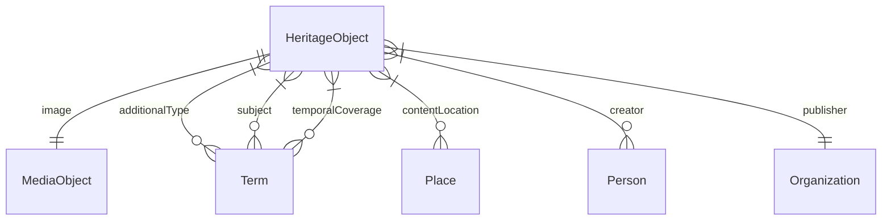

# Heritageflix v2: generic data model

## Contents

1. [Conceptual Data Model (CDM)](#conceptual-data-model-cdm)

## Conceptual Data Model (CDM)

The data that are required to make the app work.

### Entities and properties

#### Heritage object

|Name|Datatype|Cardinality|Description|Example|
|-|-|-|-|-|
|ID|ID|1|Identifier of the object|`http://data.collectienederland.nl/resource/document/rce-beeldbank/837866ec-3f22-11e4-9dc7-3b4bf4a0ed46-0091c9e8-9b8c-6926-88c1-2eb6172a3316`|
|Type|String|1|Type of the object|`CreativeWork`|
|Specific type|String|0 or more|Specific type of the object|`foto`, `tekening`|
|Title|String|0 or 1|Primary title of the object|-|
|Description|String|1|Short description of the object|`Zicht op de noorder transeptgevel`|
|Subject|String|0 or more|Subject of the object|`kerken`|
|Date created|String|1|Date when the object was created (precise or a range)|`1907-09-28`|
|Year created|Number|1|Year (if known or retrievable from a range or string) when the object was created, to allow for sorting|`1907`|
|Location|ID|0 or more|Location depicted on or described by the object|`https://sws.geonames.org/2744145/`|
|URL of webpage|URL|0 or 1|Online location where the object is presented|`http://beeldbank.cultureelerfgoed.nl/alle-afbeeldingen/detail/0091c9e8-9b8c-6926-88c1-2eb6172a3316/media/a42dfbdf-97be-2d58-772c-e87b4b2d7277`|
|Temporal coverage|ID|0 or more|E.g. period and style of the object|`http://vocab.getty.edu/aat/300021147`|
|Image|ID|1|Image of the object|`https://images.memorix.nl/rce/thumb/fullsize/a42dfbdf-97be-2d58-772c-e87b4b2d7277.jpg/image`|
|Creator|ID|1 or more|Creator of the object|-|
|Publisher|ID|1|Publisher of the object|`https://www.cultureelerfgoed.nl/`|
|Source|ID|1|Source of the data, for traceability|`http://data.collectienederland.nl/resource/document/rce-beeldbank/837866ec-3f22-11e4-9dc7-3b4bf4a0ed46-0091c9e8-9b8c-6926-88c1-2eb6172a3316`|

### Media object

|Name|Datatype|Cardinality|Description|Example|
|-|-|-|-|-|
|ID|ID|1|Identifier of the object|`https://images.memorix.nl/rce/thumb/fullsize/a42dfbdf-97be-2d58-772c-e87b4b2d7277.jpg/image`|
|Type|String|1|Type of the object|`Image`|
|URL|URL|1|Online location where the object can be found|`https://images.memorix.nl/rce/thumb/fullsize/a42dfbdf-97be-2d58-772c-e87b4b2d7277.jpg`|
|MIME type|String|0 or 1|MIME type of the object|`image/jpeg`|
|License|String|1|License for using the object|`Naamsvermelding-GelijkDelen 3.0 Unported (CC BY-SA 3.0)`|

### Term

|Name|Datatype|Cardinality|Description|Example|
|-|-|-|-|-|
|ID|ID|1|Identifier of the term|`https://data.cultureelerfgoed.nl/term/id/cht/c15af234-87b0-433c-bbe1-880a6f717057`|
|Type|String|1|Type of the term|`Term`|
|Name|String|1|Name of the term|`kerken`|

### Place

|Name|Datatype|Cardinality|Description|Example|
|-|-|-|-|-|
|ID|ID|1|Identifier of the place|`https://sws.geonames.org/2744145/`|
|Type|String|1|Type of the place|`Place`|
|Name|String|1|Primary name of the place|`Wouw (NL)`|
|Part of|ID|0 or more|Identifier of the place of which this place is a part, e.g. a municipality or a province|`https://sws.geonames.org/2749990/`|

### Person

|Name|Datatype|Cardinality|Description|Example|
|-|-|-|-|-|
|ID|ID|1|Identifier of the person|-|
|Type|String|1|Type of the person|`Person`|
|Name|String|1|Name of the person|`Hoog, G. de`|

### Organization

|Name|Datatype|Cardinality|Description|Example|
|-|-|-|-|-|
|ID|ID|1|Identifier of the organization|`https://www.cultureelerfgoed.nl/`|
|Type|String|1|Type of the organization|`Organization`|
|Name|String|1|Name of the organization|`Rijksdienst voor het Cultureel Erfgoed`|
|URL of homepage|URL|1|Homepage of the organization, for finding more information|`https://www.cultureelerfgoed.nl/`|

### Diagram

## RDF Data Model (RDM)

Translation of the Conceptual Data Model to RDF.

The aim is to make it easy for frontend developers to use the data. This means: use a single, straightforward vocabulary and transform the data of the sources, where applicable, to make it fit the vocabulary.

### Entities and properties

#### Heritage object

|Name in CDM|Name|Datatype|Description|Remarks|Example|
|-|-|-|-|-|-|
|ID|Not applicable|IRI|Identifier of the object|-|`http://data.collectienederland.nl/resource/document/rce-beeldbank/837866ec-3f22-11e4-9dc7-3b4bf4a0ed46-0091c9e8-9b8c-6926-88c1-2eb6172a3316`|
|Type|`rdf:type`|IRI|Type of the object|-|Value allowed: `schema:CreativeWork`|
|Specific type|`schema:additionalType`|IRI|Specific type of the object|Terminology source: CHT.|`https://data.cultureelerfgoed.nl/term/id/cht/05ff3aa4-a6e8-4d93-b261-94f2bcb6167d`|
|Title|`schema:name`|Literal|Primary title of the object|-|-|
|Description|`schema:description`|Literal|Short description of the object|-|`Zicht op de noorder transeptgevel`|
|Subject|`schema:about`|IRI|Subject of the object|Terminology source: CHT.|`https://data.cultureelerfgoed.nl/term/id/cht/c15af234-87b0-433c-bbe1-880a6f717057`|
|Date created|`schema:temporal`|Literal|Date when the object was created|TBD: is there a better predicate? Dates aren't always ISO 8601 formatted, so we can't use `schema:dateCreated`|-|`1907-09-28`|
|Year created|`schema:dateCreated`|`xsd:gYear`|Year when the object was created|The year doesn't always come from the source - it could have been extracted by NDE's data processor|`1907`|
|Location|`schema:contentLocation`|IRI|Location depicted on or described by the object|Terminology source: GeoNames. TBD: in Schema.org this should be of type `schema:Place`|`https://sws.geonames.org/2744145/`|
|URL of webpage|`schema:mainEntityOfPage`|IRI|Online location where the object is presented|-|`http://beeldbank.cultureelerfgoed.nl/alle-afbeeldingen/detail/0091c9e8-9b8c-6926-88c1-2eb6172a3316/media/a42dfbdf-97be-2d58-772c-e87b4b2d7277`|
|Temporal coverage|`schema:temporalCoverage`|IRI|-|This data doesn't always come from the source; it could have been added by NDE's data processor|`http://vocab.getty.edu/aat/300021147`|
|Image|`schema:image`|IRI|Image of the object|-|(blank node)|
|Creator|`schema:creator`|IRI|Creator of the object|Terminology source: RKDartists where applicable; otherwise blank nodes|(blank node)|
|Publisher|`schema:publisher`|IRI|Publisher of the object|-|`https://www.cultureelerfgoed.nl/`|
|Source|`schema:isBasedOn`|IRI|Source of the data, for traceability|-|`http://data.collectienederland.nl/resource/document/rce-beeldbank/837866ec-3f22-11e4-9dc7-3b4bf4a0ed46-0091c9e8-9b8c-6926-88c1-2eb6172a3316`|

#### Media object

|Name in CDM|Name|Datatype|Remarks|Example|
|-|-|-|-|-|
|ID|Not applicable|IRI|A blank node|-|
|Type|`rdf:type`|IRI|Value allowed: `schema:ImageObject`|`schema:ImageObject`|
|URL|`schema:contentUrl`|IRI|-|`https://images.memorix.nl/rce/thumb/fullsize/a42dfbdf-97be-2d58-772c-e87b4b2d7277.jpg`|
|MIME type|`schema:encodingFormat`|Literal|This value probably doesn't come from the source; it's added by NDE's data processor|`image/jpeg`|
|License|`schema:license`|IRI|TBD: should we also expose the name of the license, e.g. "Public Domain"?|`http://creativecommons.org/licenses/by-sa/3.0/`|

#### Term

|Name in CDM|Name|Datatype|Remarks|Example|
|-|-|-|-|-|
|ID|Not applicable|IRI|`https://data.cultureelerfgoed.nl/term/id/cht/c15af234-87b0-433c-bbe1-880a6f717057`|
|Type|`rdf:type`|IRI|Value allowed: `skos:Concept`|`skos:Concept`|
|Name|`skos:prefLabel`|Literal|Language: Dutch|`kerken`|

#### Place

|Name in CDM|Name|Datatype|Remarks|Example|
|-|-|-|-|-|
|ID|Not applicable|IRI|-|`https://sws.geonames.org/2744145/`|
|Type|`rdf:type`|IRI|Value allowed: `gn:Feature`|`gn:Feature`|
|Name|`gn:name`|Literal|-|`Wouw (NL)`|

#### Person

|Name in CDM|Name|Datatype|Remarks|Example|
|-|-|-|-|-|
|ID|Not applicable|IRI|-|-|
|Type|`rdf:type`|IRI|Value allowed: `schema:Person`|`schema:Person`|
|Name|`schema:name`|Literal|-|`Hoog, G. de`|

#### Organization

|Name in CDM|Name|Datatype|Remarks|Example|
|-|-|-|-|-|
|ID|Not applicable|IRI|This value probably doesn't come from the source; it's added by NDE's data processor|`https://www.cultureelerfgoed.nl`|
|Type|`rdf:type`|IRI|Value allowed: `schema:Organization`|`schema:Organization`|
|Name|`schema:name`|Literal|-|`Rijksdienst voor het Cultureel Erfgoed`|
|URL of homepage|`schema:mainEntityOfPage`|IRI|This value doesn't come from the source; it's added by NDE's data processor|`https://www.cultureelerfgoed.nl`|
