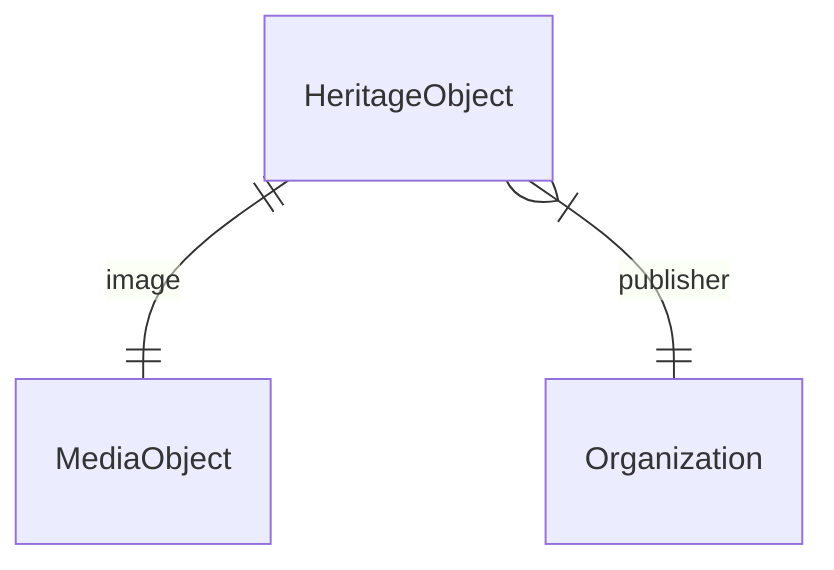

# Modemuze: data model

## Contents

1. [Conceptual Data Model (CDM)](#conceptual-data-model-cdm)

## Conceptual Data Model (CDM)

The data that are required to make the knowledge graph work.

### Entities and properties

#### Heritage object

|Name|Datatype|Cardinality|Description|Remarks|Example|
|-|-|-|-|-|-|
|ID|ID|1|Identifier of the object|-|`localID/europeana-fashion/ZOV-08747`|
|Type|String|1|Type of the object|-|`jas`, `rok`|
|Title|String|1|Primary title of the object|-|`Jak of kassekien`|
|Description|String|0 or 1|Short description of the object|-|`Een zwart met blauw zijden vrouwenjak of kassekien, met driekwart mouwen, en een lange, wijde schoot. Een diepe, ronde, halsuitsnijding voor en een rechte halslijn achter. Gemaakt van een zijde/wol mengweefsel en gevoerd met donkerblauwe wollen grein. Het jak sluit met behulp van acht haken en ogen. Op de elleboog versiering van gefronste bandjes van dezelfde stof. De schoot krijgt wijdte door een stolpplooi in elk van de (naar achter geplaatste) zijnaden. Aan de binnenkant twee blauw/witte lusjes om het jak op het keurslijf te spelden + twee bandjes om het onder de punt van het keurslijf vast te strikken.`|
|Date created|Date|0 or 1|Date when the object was created (precise or a range)|TBD: normalized date?|`1775/1824`|
|Material|ID|0 or more|-|-|`zijde`|
|Technique|ID|0 or more|-|-|`geweven`|
|Image|ID|1|Image of the object|-|`https://zaansmuseum.adlibhosting.com/webapi/wwwopac.ashx?command=getcontent&amp;server=images&amp;value=ZOV-08747.jpg/image`|
|Creator|String|0 or more|Creator of the object|-|(todo)|
|Publisher|ID|1|Publisher of the object|-|`https://zaansmuseum.nl/`|
|Source|ID|1|Source of the data, for traceability|-|(todo)|

### Media object

|Name|Datatype|Cardinality|Description|Remarks|Example|
|-|-|-|-|-|-|
|ID|ID|1|Identifier of the object|-|`https://zaansmuseum.adlibhosting.com/webapi/wwwopac.ashx?command=getcontent&amp;server=images&amp;value=ZOV-08747.jpg/image`|
|Type|String|1|Type of the object|-|`Image`|
|URL|URL|1|Online location where the object can be found|-|`https://zaansmuseum.adlibhosting.com/webapi/wwwopac.ashx?command=getcontent&amp;server=images&amp;value=ZOV-08747.jpg`|
|MIME type of the object|String|0 or 1|MIME type of the object|-|`image/jpeg`|
|License|String|1|License for using the object|-|`Public Domain`|

### Organization

|Name|Datatype|Cardinality|Description|Remarks|Example|
|-|-|-|-|-|-|
|ID|ID|1|Identifier of the organization|-|`https://www.zaansmuseum.nl/`|
|Type|String|1|Type of the organization|-|`Organization`|
|Name|String|1|Primary name of the organization|-|`Zaans Museum`|
|URL of homepage|URL|0 or 1|Homepage of the organization, for finding more information|-|`https://www.zaansmuseum.nl/`|

### Diagram

