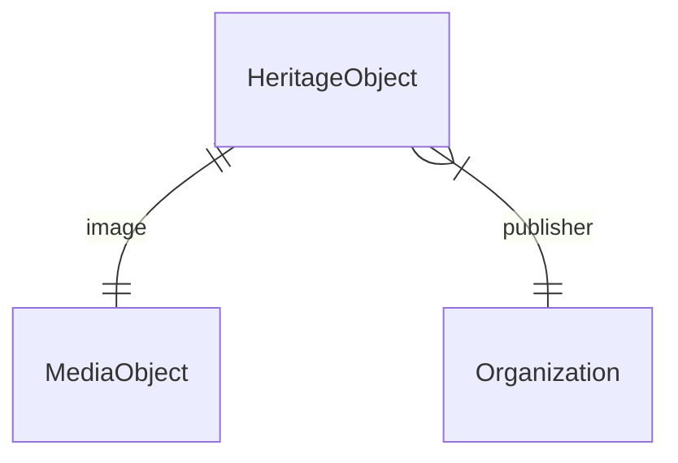

# Modemuze: data model

## Contents

1. [Conceptual Data Model (CDM)](#conceptual-data-model-cdm)
1. [RDF Data Model (RDM)](#rdf-data-model-rdm)

## Conceptual Data Model (CDM)

The data that are required to make the knowledge graph work.

### Entities and properties

#### Heritage object

|Name|Datatype|Cardinality|Description|Remarks|Example|
|-|-|-|-|-|-|
|ID|ID|1|Identifier of the object|-|`https://modemuze.nl/localID/europeana-fashion/ZM-17430`|
|Type|String|1|Type of the object|-|`kinderkleding`|
|Title|String|1|Primary title of the object|-|`Paars gebloemde schootjak voor een meisje`|
|Description|String|0 or 1|Short description of the object|-|`Paars, gebloemd jak, een zogenaamde schootjak voor een meisje (meisjesjak). Het lijfje is middenvoor V-vormig ingerimpeld aan de onderkant. Aan de bovenkant is de stof ingerimpeld in de schouder. De mouw is strak aan de bovenkant met extra ruimte vanaf de elleboog, weer smal toelopend naar de pols. Het bovenlijf en de armen zijn gevoerd met linnen, de schoot niet. De naden zijn gepaspoileerd (versierd met tussen gestikte koordjes). Het jak sluit middenvoor aan de hals met een haak en een trensje. Ter hoogte van de boezem 16 cm geen sluiting, vervolgens zes haken en trensjes tot aan de taille. Het mouwsplit sluit met behulp van drie haken en trensjes. De schoot is achter over een breedte van 37 cm ingerimpeld, middenvoor glad. De weefbreedte van de stof is 64 cm. Katoendruk. Patroon van verticale, zwartwitte bladnerven in combinatie met roze/rode, witte bloemen met paarse en taupe blaadjes,afgewisseld met verticale bloem-en bladranken op paars witte ondergrond.`|
|Date created|Date|0 or 1|Date when the object was created (precise or a range)|-|`1840/1850`|
|Material|ID|0 or more|Material that the object is made from|-|`textiel`|
|Technique|ID|0 or more|Technique used for making the object|-|`geweven`|
|Image|ID|1|Image of the object|-|-|
|Creator|ID|0 or more|Creator of the object|-|-|
|Publisher|ID|1|Publisher of the object|-|`https://zaansmuseum.nl/`|
|Source|ID|1|Source of the data, for traceability|-|-|

### Media object

|Name|Datatype|Cardinality|Description|Remarks|Example|
|-|-|-|-|-|-|
|ID|ID|1|Identifier of the object|-|-|
|Type|String|1|Type of the object|-|`Image`|
|URL|URL|1|Online location where the object can be found|-|`https://zaansmuseum.adlibhosting.com/webapi/wwwopac.ashx?command=getcontent&amp;server=images&amp;value=ZOV-08747.jpg`|
|MIME type of the object|String|0 or 1|MIME type of the object|-|`image/jpeg`|
|License|String|1|License for using the object|-|`Public Domain`|

### Organization

|Name|Datatype|Cardinality|Description|Remarks|Example|
|-|-|-|-|-|-|
|ID|ID|1|Identifier of the organization|-|`https://zaansmuseum.nl/`|
|Type|String|1|Type of the organization|-|`Organization`|
|Name|String|1|Primary name of the organization|-|`Zaans Museum`|

### Diagram



## RDF Data Model (RDM)

Translation of the Conceptual Data Model to RDF.

The aim is to make it easy to query the data in a knowledge graph. This means: use a single, straightforward vocabulary and transform the data of the sources, where applicable, to make it fit the vocabulary.

### Namespaces

1. `edmfp: http://www.europeanafashion.eu/edmfp/`
1. `schema: https://schema.org/`

### Entities and properties

#### Heritage object

|Name in CDM|Name|Datatype|Description|Remarks|Example|
|-|-|-|-|-|-|
|ID|n/a|IRI|Identifier of the object|-|`https://modemuze.nl/localID/europeana-fashion/ZM-17430`|
|n/a|`rdf:type`|IRI|Type of the object|-|`schema:CreativeWork`|
|Type|`schema:additionalType`|IRI|Specific type of the object|Terminology source: AAT or EFT|`http://thesaurus.europeanafashion.eu/thesaurus/10436`|
|Title|`schema:name`|Literal|Primary title of the object|-|`Paars gebloemde schootjak voor een meisje`|
|Description|`schema:description`|Literal|Short description of the object|-|`Paars, gebloemd jak, een zogenaamde schootjak voor een meisje (meisjesjak). Het lijfje is middenvoor V-vormig ingerimpeld aan de onderkant. Aan de bovenkant is de stof ingerimpeld in de schouder. De mouw is strak aan de bovenkant met extra ruimte vanaf de elleboog, weer smal toelopend naar de pols. Het bovenlijf en de armen zijn gevoerd met linnen, de schoot niet. De naden zijn gepaspoileerd (versierd met tussen gestikte koordjes). Het jak sluit middenvoor aan de hals met een haak en een trensje. Ter hoogte van de boezem 16 cm geen sluiting, vervolgens zes haken en trensjes tot aan de taille. Het mouwsplit sluit met behulp van drie haken en trensjes. De schoot is achter over een breedte van 37 cm ingerimpeld, middenvoor glad. De weefbreedte van de stof is 64 cm. Katoendruk. Patroon van verticale, zwartwitte bladnerven in combinatie met roze/rode, witte bloemen met paarse en taupe blaadjes,afgewisseld met verticale bloem-en bladranken op paars witte ondergrond.`|
|Date created|`schema:dateCreated`|Date|Date when the object was created (precise or a range)|-|`1840/1850`|
|Material|`schema:material`|IRI|Material that the object is made from|Terminology source: AAT or EFT|`http://vocab.getty.edu/aat/300231565`|
|Technique|`edmfp:technique`|IRI|Technique used for making the object|Is there a suitable predicate in Schema.org? Terminology source: AAT or EFT|`http://vocab.getty.edu/aat/300053642`|
|Image|`schema:image`|IRI|Image of the object|Blank node|`https://zaansmuseum.adlibhosting.com/webapi/wwwopac.ashx?command=getcontent&server=images&value=ZM-17430.jpg/image`|
|Creator|`schema:creator`|IRI|Creator of the object|TBD: terminology source? Probably RKDartists|-|
|Publisher|`schema:publisher`|IRI|Publisher of the object|-|`https://zaansmuseum.nl/`|
|Source|`schema:isBasedOn`|IRI|Source of the data, for traceability|-|`https://modemuze.nl/localID/europeana-fashion/ZM-17430`|

#### Media object

|Name in CDM|Name|Datatype|Remarks|Example|
|-|-|-|-|-|
|ID|n/a|IRI|Blank node|`https://zaansmuseum.adlibhosting.com/webapi/wwwopac.ashx?command=getcontent&server=images&value=ZM-17430.jpg/image`|
|Type|`rdf:type`|IRI|Value allowed: `schema:ImageObject`|`schema:ImageObject`|
|URL|`schema:contentUrl`|IRI|-|`https://zaansmuseum.adlibhosting.com/webapi/wwwopac.ashx?command=getcontent&server=images&value=ZM-17430.jpg`|
|MIME type|`schema:encodingFormat`|Literal|This value doesn't come from the source; it's added by NDE's data processor|`image/jpeg`|
|License|`schema:license`|IRI|TBD: should we also expose the name of the license, e.g. "BY-SA"?|`http://creativecommons.org/publicdomain/zero/1.0/`|

#### Organization

|Name in CDM|Name|Datatype|Remarks|Example|
|-|-|-|-|-|
|ID|Not applicable|IRI|TBD: can we get this info from the source? Or do we need to add it?|`https://zaansmuseum.nl`|
|Type|`rdf:type`|IRI|Value allowed: `schema:Organization`|`schema:Organization`|
|Name|`schema:name`|Literal|-|`Zaans Museum`|

### Example

#### Heritage object

```turtle
<https://modemuze.nl/localID/europeana-fashion/ZM-17430>
  a schema:CreativeWork ;
  schema:additionalType <http://thesaurus.europeanafashion.eu/thesaurus/10436> ;
  schema:name "Paars gebloemde schootjak voor een meisje" ;
  schema:description "Paars, gebloemd jak, een zogenaamde schootjak voor een meisje (meisjesjak). Het lijfje is middenvoor V-vormig ingerimpeld aan de onderkant. Aan de bovenkant is de stof ingerimpeld in de schouder. De mouw is strak aan de bovenkant met extra ruimte vanaf de elleboog, weer smal toelopend naar de pols. Het bovenlijf en de armen zijn gevoerd met linnen, de schoot niet. De naden zijn gepaspoileerd (versierd met tussen gestikte koordjes). Het jak sluit middenvoor aan de hals met een haak en een trensje. Ter hoogte van de boezem 16 cm geen sluiting, vervolgens zes haken en trensjes tot aan de taille. Het mouwsplit sluit met behulp van drie haken en trensjes. De schoot is achter over een breedte van 37 cm ingerimpeld, middenvoor glad. De weefbreedte van de stof is 64 cm. Katoendruk. Patroon van verticale, zwartwitte bladnerven in combinatie met roze/rode, witte bloemen met paarse en taupe blaadjes,afgewisseld met verticale bloem-en bladranken op paars witte ondergrond." ;
  schema:dateCreated "1840/1850" ;
  schema:material <http://vocab.getty.edu/aat/300231565> ;
  edmfp:technique <http://vocab.getty.edu/aat/300053642> ;
  schema:image <https://zaansmuseum.adlibhosting.com/webapi/wwwopac.ashx?command=getcontent&server=images&value=ZM-17430.jpg/image> ;
  schema:publisher <https://zaansmuseum.nl> ;
  schema:isBasedOn <https://modemuze.nl/localID/europeana-fashion/ZM-17430> .
```

#### Media object

```turtle
<https://zaansmuseum.adlibhosting.com/webapi/wwwopac.ashx?command=getcontent&server=images&value=ZM-17430.jpg/image>
  a schema:ImageObject ;
  schema:contentUrl <https://zaansmuseum.adlibhosting.com/webapi/wwwopac.ashx?command=getcontent&server=images&value=ZM-17430.jpg> ;
  schema:encodingFormat "image/jpeg" ;
  schema:license <http://creativecommons.org/publicdomain/zero/1.0/> .
```

#### Organization

```turtle
<https://zaansmuseum.nl>
  a schema:Organization ;
  schema:name "Zaans Museum" .
```
